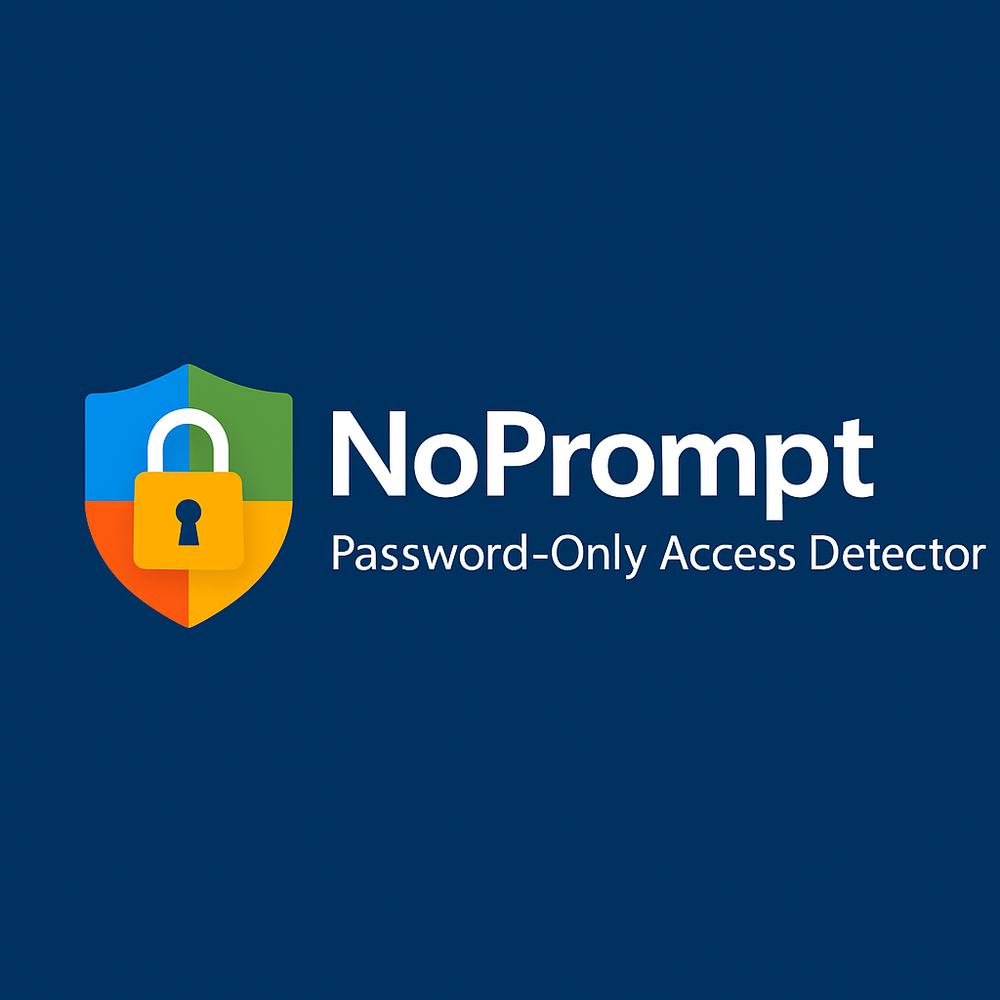

<p align="center">
  
</p>

<h1 align="center">NoPrompt</h1>
<p align="center"><i>Password-Only Access Detector for Entra ID APIs</i></p>


---

## 🚀 What is NoPrompt?

NoPrompt is a lightweight tool to **check if Microsoft Entra ID APIs allow password-only authentication** — meaning whether access can be granted with just a username and password, without requiring Multi-Factor Authentication (MFA).

It sends OAuth2 token requests simulating various device user agents to quickly detect if password-only access is possible on different Microsoft APIs.

---

## 🔍 Why Use NoPrompt?

- Quickly verify if password-only access is enabled for your account on key Microsoft APIs.
- Understand where MFA enforcement is missing or not applied.
- Help improve your account security posture by identifying weak access controls.
- Evaluate your organization's Conditional Access policies effectiveness.

---

## 🆚 How is NoPrompt Different?

**NoPrompt** focuses on a unique gap in identity security tooling by testing for **password-only access across core Microsoft Entra ID APIs** using simulated device fingerprints (user agents). Here's how it's different:

| Feature                                  | NoPrompt                                                                 |
|------------------------------------------|--------------------------------------------------------------------------|
| 🔐 **Targeted Scope**                    | Focuses specifically on Microsoft Entra ID API token endpoints.          |
| 🎭 **User Agent Simulation**             | Tests multiple real-world device/user-agent scenarios to expose bypasses in Conditional Access. |
| ⚡ **Lightweight & Fast**                | CLI-based and designed for rapid testing without requiring bulky frameworks. |
| 🚫 **Non-Invasive**                      | Does not perform account enumeration or aggressive brute-force behavior. |
| ✅ **MFA Bypass Visibility**             | Helps detect if Conditional Access or MFA enforcement is properly applied. |
| 📊 **Clear Per-API Feedback**            | Provides readable output per API tested, helping prioritize remediation. |

---

## 🔧 Installation 

You can run NoPrompt using **Python 3.8+**. Follow these steps:

```bash
# 1. Clone the repository
git clone https://github.com/terminalOO12/NoPrompt.git
cd noprompt

# 2. (Optional) Create a virtual environment
python3 -m venv venv
source venv/bin/activate   # On Windows: venv\Scripts\activate

# 3. Install dependencies
pip install -r requirements.txt
```

## Command-Line Options

| Flag                 | Description                                              | Example                 |
|----------------------|----------------------------------------------------------|-------------------------|
| `--useragent`, `-u`  | Specify a user agent to test (case-insensitive).         | `--useragent Windows`   |
|                      | Use `all` (default) to test all available user agents.   | `--useragent all`       |

---

## Supported User Agents

- Windows
- Linux
- MacOS
- Android
- iPhone
- WindowsPhone

---

## ▶️ Usage Examples

| Command                                | Description                         |
|---------------------------------------|-----------------------------------|
| `python3 noprompt.py -h`                   | Show help and available options   |
| `python3 noprompt.py --useragent all`      | Run tests for all user agents (default) |
| `python3 noprompt.py --useragent Windows`  | Test using the Windows user agent |
| `python3 noprompt.py --useragent Linux`    | Test using the Linux user agent   |
| `python3 noprompt.py --useragent MacOS`    | Test using the MacOS user agent   |
| `python3 noprompt.py --useragent Android`  | Test using the Android user agent |
| `python3 noprompt.py --useragent iPhone`   | Test using the iPhone user agent  |
| `python3 noprompt.py --useragent WindowsPhone` | Test using the WindowsPhone user agent |

---
# 🔎 Example Use Case

You’ve configured a Conditional Access policy to require MFA, but **only for mobile platforms**.  
A threat actor on a Windows machine may still get **password-only access** if:

- Desktop platforms like Windows/macOS/Linux are excluded,
- Specific APIs (e.g., **Azure Resource Manager**) are not in scope,
- App enforcement rules are too narrow.

**NoPrompt** allows you to validate these gaps instantly and verify real-world enforcement.

---

# 🧱 Conditional Access Policy Detection

Want to understand what a weak Conditional Access policy might look like?  
Here are some common misconfigurations:

### 1. Azure Resource Manager Is Excluded
This creates a high-risk path for password-only access.


---

### 2. Only Android and iOS Are Selected
Desktop platforms like Windows, Linux, and macOS remain unprotected.


---

### 3. MFA Required — But Not Globally Enforced
MFA may be required, but enforcement gaps exist due to incomplete scope.


---

> 🛡️ **NoPrompt helps you catch these oversights before attackers do.**

---


## 🧪 Sample Output

```plaintext

  _   _         _____                           _
 | \ | |       |  __ \                         | |
 |  \| | ___   | |__) | __ ___  _ __ ___  _ __ | |_
 | . ` |/ _ \  |  ___/ '__/ _ \| '_ ` _ \| '_ \| __|
 | |\  | (_) | | |   | | | (_) | | | | | | |_) | |_
 |_| \_|\___/  |_|   |_|  \___/|_| |_| |_| .__/ \__|
                                         | |
                                         |_|

Password-Only Access Detector for Entra ID APIs

Enter your email: test@test.com
Enter your password:

######### PASSWORD-ONLY ACCESS CHECK #########

==== Testing User Agent: Windows ====
   AAD Graph API                  | ✅ Access Granted
   Microsoft Graph API            | ✅ Access Granted
   Service Management API         | ✅ Access Granted

==== Testing User Agent: Linux ====
   AAD Graph API                  | ✅ Access Granted
   Microsoft Graph API            | ✅ Access Granted
   Service Management API         | ✅ Access Granted

==== Testing User Agent: MacOS ====
   AAD Graph API                  | ✅ Access Granted
   Microsoft Graph API            | ✅ Access Granted
   Service Management API         | ✅ Access Granted

==== Testing User Agent: Android ====
   AAD Graph API                  | 🔒 Blocked Requires MFA
   Microsoft Graph API            | 🔒 Blocked Requires MFA
   Service Management API         | ✅ Access Granted

==== Testing User Agent: iPhone ====
   AAD Graph API                  | 🔒 Blocked Requires MFA
   Microsoft Graph API            | 🔒 Blocked Requires MFA
   Service Management API         | ✅ Access Granted

==== Testing User Agent: WindowsPhone ====
   AAD Graph API                  | ✅ Access Granted
   Microsoft Graph API            | ✅ Access Granted
   Service Management API         | ✅ Access Granted

```


# 📬 Feedback & Contributions

We welcome issues and pull requests!  
If you’d like to suggest improvements, report bugs, or contribute, [open an issue](https://github.com/terminalOO12/NoPrompt/issues) or fork the repository.

---

# ⚠️ Disclaimer

**NoPrompt** is a passive security testing tool. Use it **only** on accounts and tenants that you **own or are explicitly authorized to assess**.

> Misuse of this tool may violate your organization's policies or applicable laws.
