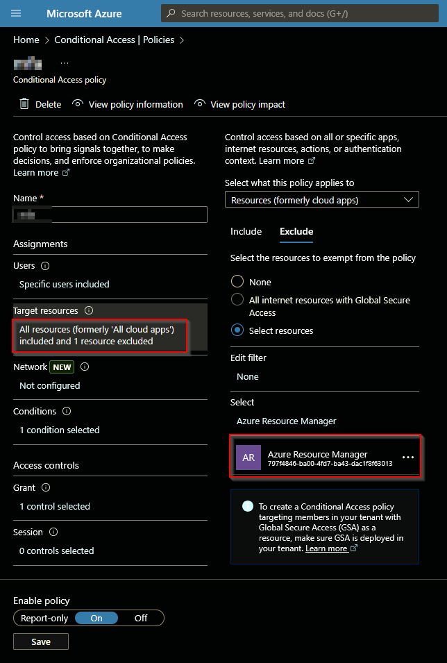
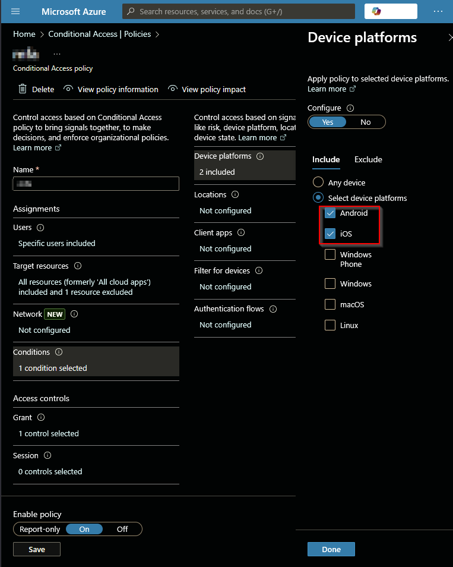

# 🚀 What is NoPrompt?

**NoPrompt** is a lightweight security testing tool that checks if Microsoft Entra ID (Azure AD) APIs and login portals allow **password-only authentication** — meaning access with just a username and password, without requiring Multi-Factor Authentication (MFA).

The tool simulates OAuth2 token requests using multiple device user agents and can optionally rotate IP addresses across AWS regions to bypass location-based Conditional Access or IP restrictions. This helps in detecting misconfigured Conditional Access policies and understanding real-world attack feasibility.

---

## 🔑 Key Capabilities

- ✅ Testing **Microsoft Graph**, **AAD Graph**, and **Service Management APIs**
- 🌐 Web login automation using **headless browser simulation**
- 🌍 **IP rotation** via AWS API Gateway across:
  - Single region
  - Multiple regions
  - Random regions
- 📁 Support for **multiple credentials from a file**
- 📱 **User-agent switching** to simulate different device types

---

# 🔍 Why Use NoPrompt?

- 🚀 Quickly verify if **password-only access** is enabled for your account on critical Microsoft APIs and login portals.
- ❌ Detect missing **MFA enforcement** or weak **Conditional Access** configurations.
- 🧪 Evaluate Conditional Access policies under **real-world attack scenarios**, including geo-based and IP-based restrictions.
- 🛡️ Strengthen security posture by identifying misconfigurations **before attackers do**.

---

# 🆚 How is NoPrompt Different?

**NoPrompt** addresses a critical identity security gap by validating **password-only authentication** and **policy effectiveness** across Microsoft Entra ID APIs and [login.microsoftonline.com](https://login.microsoftonline.com).

| Feature                  | NoPrompt Advantage                                                                 |
|--------------------------|-------------------------------------------------------------------------------------|
| 🔐 **Targeted Scope**     | Focused exclusively on **Microsoft Entra ID token endpoints** and **login portals**. |
| 🎭 **User Agent Simulation** | Emulates multiple real-world device fingerprints (Windows, Linux, iOS, Android, etc.) to expose **Conditional Access loopholes**. |
| 🌍 **IP Rotation Support** | Leverages **AWS API Gateway** to rotate IPs across specific, all, or random regions, simulating attackers from different geographies. |
| ⚡ **Lightweight & Fast**   | **CLI-based**, minimal dependencies, rapid testing without bulky frameworks.        |
| 🚫 **Non-Invasive**        | No account enumeration or brute-force attacks – purely checks **MFA enforcement** on valid credentials. |
| ✅ **MFA Bypass Visibility** | Detects scenarios where **MFA or Conditional Access** is misapplied or ineffective. |
| 📊 **Clear Per-API Feedback** | Structured results for each Microsoft API and web login tested, enabling **prioritized remediation**. |

---

# 🔧 Installation

NoPrompt runs on Python 3.8+. To install:

### 1. Clone the repository

```bash
git clone https://github.com/terminalOO12/NoPrompt.git
cd NoPrompt
```
### 2. (Optional) Create a virtual environment

```bash
python3 -m venv venv
source venv/bin/activate   # On Windows: venv\Scripts\activate
```

### 3. Install dependencies

```bash
pip install -r requirements.txt
```


### 4. (Optional) Setup AWS Credentials for IP Rotation  
If you plan to use `--iprotator`, configure your AWS credentials (for API Gateway) using any of these methods:

- **AWS CLI**:

  ```bash
  aws configure
    ```

- **Environment Variables**:

  ```bash
  export AWS_ACCESS_KEY_ID=your-key
  export AWS_SECRET_ACCESS_KEY=your-secret
    ```

### 5. Install ChromeDriver (for Selenium)


- **Linux/Mac**:

  ```bash
  sudo apt-get install chromium-chromedriver   # Ubuntu/Debian
    ```

- **Windows**:

  Download ChromeDriver and add it to PATH. (https://chromedriver.chromium.org/downloads)

---

# 🧰 Command-Line Options

| **Flag**                   | **Description**                                                                                  | **Example**                                        |
|----------------------------|--------------------------------------------------------------------------------------------------|----------------------------------------------------|
| `--useragent`, `-u`        | Specify one or more user agents (case-insensitive). Use `all` (default) to test all.            | `--useragent Windows Linux` or `--useragent all`   |
| `--credfile`               | Provide a file with multiple credentials (`email:password` per line).                           | `--credfile creds.txt`                             |
| `--iprotator`              | Enable IP rotation using AWS API Gateway for advanced Conditional Access testing.               | `--iprotator`                                      |
| `--iprotator-region`       | Set AWS region for IP rotation: single (`us-east-1`), `all` (test all regions), or `random`.    | `--iprotator-region us-east-1` or `all` or `random`|
| `--iprotator-agent`        | Run IP rotation for specific user agents or `all`.                                              | `--iprotator-agent Windows Linux` or `all`         |
| `--attempts`               | *(Used with `random`)* Number of region attempts to try. Default: `10`.                         | `--attempts 5`                                     |
| `--show-token`             | Display full OAuth access token in output (**sensitive**).                                       | `--show-token`                                     |

---

## Supported User Agents

- Windows
- Linux
- MacOS
- Android
- iPhone
- WindowsPhone

---

# ▶️ Usage Examples

| **Command**                                                                                         | **Description**                                                                                   |
|------------------------------------------------------------------------------------------------------|---------------------------------------------------------------------------------------------------|
| `python3 noprompt.py -h`                                                                             | Show help and all available options.                                                              |
| `python3 noprompt.py --useragent all`                                                                | Run tests for all user agents (default).                                                          |
| `python3 noprompt.py --useragent Windows`                                                            | Test using the Windows user agent.                                                                |
| `python3 noprompt.py --useragent Linux`                                                              | Test using the Linux user agent.                                                                  |
| `python3 noprompt.py --useragent MacOS`                                                              | Test using the MacOS user agent.                                                                  |
| `python3 noprompt.py --useragent Android`                                                            | Test using the Android user agent.                                                                |
| `python3 noprompt.py --useragent iPhone`                                                             | Test using the iPhone user agent.                                                                 |
| `python3 noprompt.py --useragent WindowsPhone`                                                       | Test using the WindowsPhone user agent.                                                           |

**IP Rotator Examples:**  

| **Command**                                                                                                             | **Description**                                                                                                 |
|--------------------------------------------------------------------------------------------------------------------------|-----------------------------------------------------------------------------------------------------------------|
| `python3 noprompt.py --iprotator --iprotator-region us-east-1`                                                          | Test with IP rotation from Specfic Region Example - AWS US East (N. Virginia) region.                                                   |
| `python3 noprompt.py --iprotator --iprotator-region all`                                                                | Rotate IP across all AWS regions for each user agent.                                                          |
| `python3 noprompt.py --iprotator --iprotator-region random --attempts 5`                                                | Rotate IP through 5 random AWS regions per user agent.                                                         |
| `python3 noprompt.py --iprotator --iprotator-region all --iprotator-agent Windows Linux`                                | Run IP rotation for Specific User Agent Example - Windows and Linux user agents only.                                                        |
| `python3 noprompt.py --credfile creds.txt --iprotator --iprotator-region random`                                        | Test multiple credentials with IP rotation across random regions.                                              |

---

# 🔎 Example Use Case

You’ve configured a Conditional Access policy to require MFA, but only for mobile platforms.  
A threat actor could still gain password-only access if:

- Desktop platforms like Windows/macOS/Linux are excluded.
- Certain APIs (e.g., Azure Resource Manager) are not covered by the policy.
- App enforcement rules are too narrow or incomplete.
- Location-based restrictions (e.g., blocking non-corporate IP ranges) are assumed but not enforced effectively.

### How NoPrompt Helps:

- Simulates multiple device user agents to reveal MFA gaps.
- Uses IP rotation across AWS regions to test Conditional Access behavior for geo-based or IP-based restrictions.
- Validates MFA enforcement on Microsoft Graph, AAD Graph, and Service Management APIs, as well as login.microsoftonline.com.

✅ **With NoPrompt**, you can instantly verify if these gaps exist and confirm if Conditional Access is working as intended in real-world conditions.

---


# 🧱 Conditional Access Policy Detection

Want to understand what a weak Conditional Access policy might look like?  
Here are some common misconfigurations:

### 1. Azure Resource Manager Is Excluded
This creates a high-risk path for password-only access.



---

### 2. Only Android and iOS Are Selected
Desktop platforms like Windows, Linux, and macOS remain unprotected.



---

### 3. MFA Required — But Not Globally Enforced
MFA may be required, but enforcement gaps exist due to incomplete scope.


---

> 🛡️ **NoPrompt helps you catch these oversights before attackers do.**

---


## 🧪 Sample Output

```plaintext

  _   _         _____                           _
 | \ | |       |  __ \                         | |
 |  \| | ___   | |__) | __ ___  _ __ ___  _ __ | |_
 | . ` |/ _ \  |  ___/ '__/ _ \| '_ ` _ \| '_ \| __|
 | |\  | (_) | | |   | | | (_) | | | | | | |_) | |_
 |_| \_|\___/  |_|   |_|  \___/|_| |_| |_| .__/ \__|
                                         | |
                                         |_|

Password-Only Access Detector for Entra ID APIs

Enter your email: test@test.com
Enter your password:

######### PASSWORD-ONLY ACCESS CHECK #########

==== Testing User Agent: Windows ====
   AAD Graph API                  | ✅ Access Granted
   Microsoft Graph API            | ✅ Access Granted
   Service Management API         | ✅ Access Granted

==== Testing User Agent: Linux ====
   AAD Graph API                  | ✅ Access Granted
   Microsoft Graph API            | ✅ Access Granted
   Service Management API         | ✅ Access Granted

==== Testing User Agent: MacOS ====
   AAD Graph API                  | ✅ Access Granted
   Microsoft Graph API            | ✅ Access Granted
   Service Management API         | ✅ Access Granted

==== Testing User Agent: Android ====
   AAD Graph API                  | 🔒 Blocked Requires MFA
   Microsoft Graph API            | 🔒 Blocked Requires MFA
   Service Management API         | ✅ Access Granted

==== Testing User Agent: iPhone ====
   AAD Graph API                  | 🔒 Blocked Requires MFA
   Microsoft Graph API            | 🔒 Blocked Requires MFA
   Service Management API         | ✅ Access Granted

==== Testing User Agent: WindowsPhone ====
   AAD Graph API                  | ✅ Access Granted
   Microsoft Graph API            | ✅ Access Granted
   Service Management API         | ✅ Access Granted

```


# 📬 Feedback & Contributions

We welcome issues and pull requests!  
If you’d like to suggest improvements, report bugs, or contribute, [open an issue](https://github.com/terminalOO12/NoPrompt/issues) or fork the repository.

---

# ⚠️ Disclaimer

**NoPrompt** is a passive security testing tool. Use it **only** on accounts and tenants that you **own or are explicitly authorized to assess**.

> Misuse of this tool may violate your organization's policies or applicable laws.
